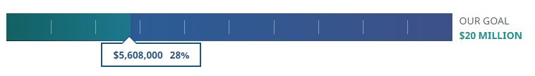

# Progress Bar snippet with loading animation

This project allows you to create a loading progress bar that is managed from a table transformation.

## Overview

The CSS & JS must be added into your page either by including it into your global files, or making a separate call to each. The jQuery library must be loaded prior to calling the JS code.

## Example

Goal | Percentage Complete (Whole numbers: do not include % sign) | Current Donation Value
---- | -------- | -----------
$20 million | 28 | $5,608,000

## Output

